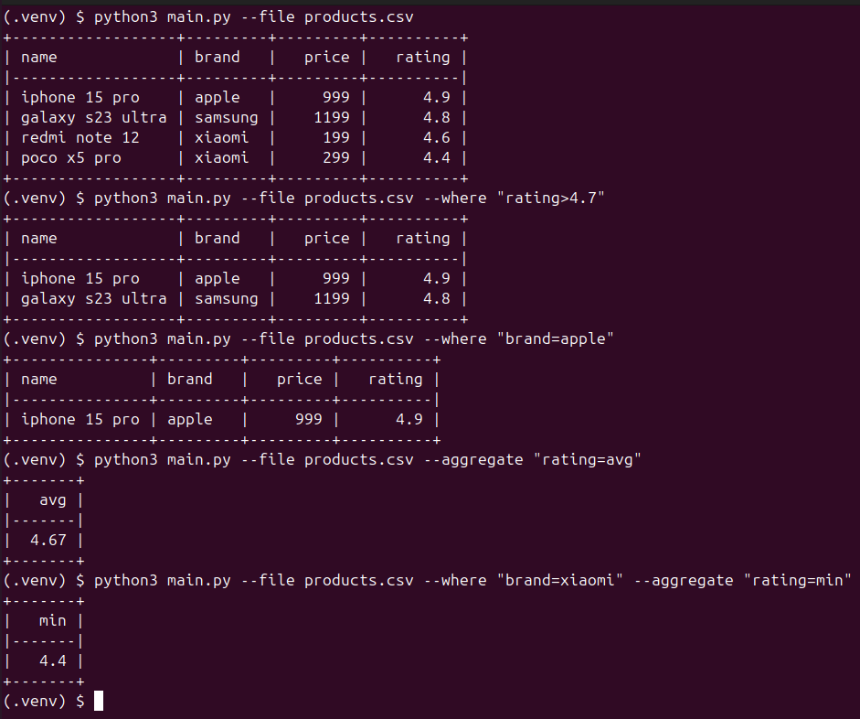

# CSV Tool

Скрипт для фильтрации, агрегации и сортировки данных из CSV-файлов.

# Задача

Нужно написать скрипт для обработки CSV-файла, поддерживающий операции: 

фильтрацию с операторами «больше», «меньше» и «равно»

агрегацию с расчетом среднего (avg), минимального (min) и максимального (max) значения

Собираем прототип, поэтому всё по простому. Фильтрацию и агрегацию делаем по одной любой колонке. Делать фильтрации с составными условия, например с and или or, а также по нескольким колонкам одновременно не нужно. Фильтрация поддерживает любые колонки, то есть с текстовыми и числовыми значениями, а агрегация только числовые. Гарантируется что входные файлы валидны, например если в колонке числа, то там все значения числа. Чтобы сфокусироваться на функционале и не отвлекаться на рутинные задачи (обработка аргументов скрипта, чтение файла и форматированный вывод), можно использовать стандартную библиотеку argparse и csv, а для красивого отображения в консоли установить библиотеку tabulate.

Пример файла csv:

```
name,brand,price,rating
iphone 15 pro,apple,999,4.9
galaxy s23 ultra,samsung,1199,4.8
redmi note 12,xiaomi,199,4.6
poco x5 pro,xiaomi,299,4.4
``` 

Пример запуска скрипта:


Для фильтрации используем where, для агрегации aggregate, значение передаются как “column=value”. Не меняем интерфейс скрипта, например не разбиваем параметр aggregate на два параметра aggregate-column и aggregate-value. 


## Запуск с аргументами и без

# no Arguments
python run_csv.py --file products.csv

# filter int Arguments
python run_csv.py --file products.csv --where "price=199"

# filter float Arguments
python run_csv.py --file products.csv --where "rating<4.4"

# filter string Arguments
python run_csv.py --file products.csv --where "brand>poco"

# filter and aggregate
python run_csv.py --file products.csv --where "brand=xiaomi" --aggregate "rating=avg"

# filter and sorting
python run_csv.py --file products.csv --where "rating>4.4" --order-by "rating=asc"

## Тесты
pytest